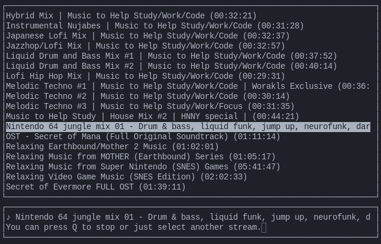

# streamr - minimalist youtube-dl audio streaming
Streamr is a Python script for streaming audio from yt-dlp compatible sites. Links can be saved to a playlist and selected inside a terminal through a curses menu.

# Requirements
Tested under Python 3.9.11, but this script doesn't do anything crazy and should work for most versions of Python 3. Install `yt-dlp` via pip and `mpv` via your package manager of choice.

# Usage
Calling `streamr` will open up a rudimentary curses interface. You can navigate up and down using arrow keys, W/S or K/J. Start streaming via right arrow or L. Pausing isn't implemented yet, but Q will stop the stream and hitting Q when no stream is playing will quit the program.

Songs are looped by default. Streamr is intended for music mixes, video game OSTs or full albums only available on YouTube that you just keep running in the background. For features that go beyond that, you need to use a proper music player setup like mpd + ncmpcpp instead.

# Adding sources
Links can be added via `streamr --add <link>`. The fetched metadata will be stored in `~/.config/streamr/config.pickle`. Removing sources is not implemented yet, but if your playlist gets too bloated you can always delete the config file and add the important links back in.
